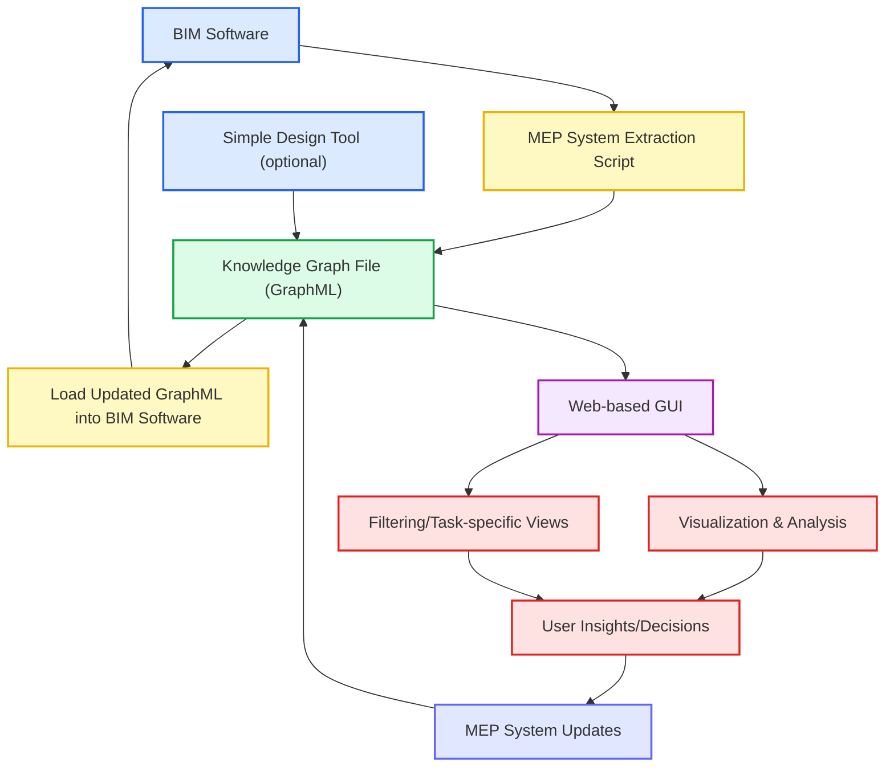
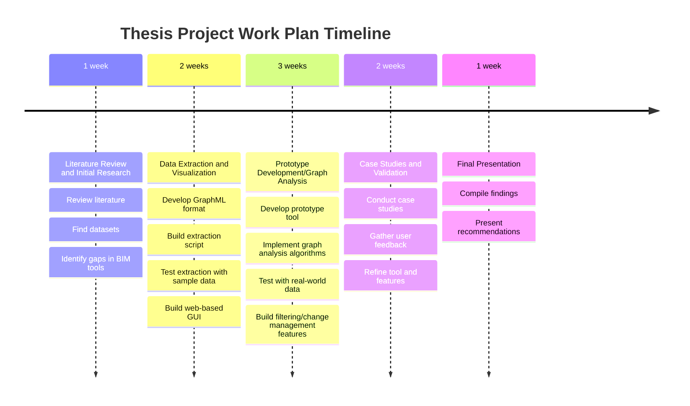

**MACAD Thesis Abstract**
# Improving BIM Interoperability for MEP Systems Using Graphs
**Krisztian Hajdu and Scott Lebow**

## Abstract

This project addresses the persistent challenge of integrating Mechanical, Electrical, and Plumbing (MEP) systems into Building Information Modeling (BIM) workflows, particularly for large campus owner-operators. Current BIM tools excel at architectural data exchange but lack robust support for MEP systems, which are often only partially modeled and poorly integrated, hindering change management and operational efficiency.

We propose developing a prototype tool that leverages GraphML to represent and analyze MEP systems within BIM environments, with a focus on Revit integration. The tool will enable filtering of MEP system graphs for task-specific analysis (e.g., maintenance, renovation), and support the incorporation and tracking of infrastructural changes over the building lifecycle. This approach will facilitate improved data exchange, lifecycle history tracking, and predictive performance analysis of MEP systems.

The project will begin with electrical systems, expanding to mechanical and plumbing domains. Outcomes include a working prototype, a framework for MEP analysis using GraphML, demonstrated methods for managing post-handover changes, and case studies validating the approach. The research will provide actionable recommendations for advancing BIM interoperability and MEP integration, supporting more efficient operations and long-term asset management.

## Problem Statement
BIM interoperability tools are mostly focused on the exchange and storage of architectural data, where changes can be administered with a high degree of automation directly within platforms like Revit. In contrast, MEP systems (especially electrical) are often only partially modeled, with many components represented only in disconnected 2D drawings, abstract diagrams, and schedules rather than as coordinated 3D elements. This disconnect hinders change management automation and leads to fragmented workflows. 
A key challenge is maintaining the operative model, which is a consolidated, post-handover representation of current building conditions. During the operations and maintenance phase of the building lifecycle, infrastructural changes occur through refurbishments and extensions (CAPEX) and maintenance (OPEX) works. For CAPEX, relevant 3D and 2D data are extracted by the asset owner, updated by the contractor, and the as-built data is integrated back into the operative model post-project by the owner. OPEX changes are smaller in scope and manually incorporated by the same. In both cases, reliably updating MEP systems and tracking the history of changes are essential for operational accuracy, data continuity, and long-term asset management.
For large campus owner-operators, the amount of interventions to manage is high, hence the inability to manage MEP systems with the same level of integration and automation as architectural elements limits efficiency and undermines the value of BIM in ongoing operations.

## Focus Areas
- Advanced BIM Interoperability and Workflow Automation
- GraphML for BIM and building analysis

## Research Questions
- How can we improve the interoperability of BIM tools to better support the integration of MEP systems, particularly for large campus owner-operators?  
- How can we leverage Graphs to store the relationships between MEP systems and other building elements to improve data exchange and management?  
- Can we apply GraphML techniques to analyze and predict the performance of MEP systems in a BIM model, and how can this be used to inform maintenance and operations decisions?
- How can we support consistent updates and historical tracking of lifecycle changes in the operative model?

## Methodology
This research will involve a combination of literature review, case studies, and practical implementation.  We will review existing BIM interoperability tools and identify gaps in their support for MEP systems.  We will then develop a prototype tool that leverages Graphs to store and manage the relationships between MEP systems and other building elements.  Finally, we will apply GraphML techniques to analyze the performance of MEP systems in a BIM model and evaluate the effectiveness of our approach through case studies with large campus owner-operators.

We will start by building a framework for electrical systems, as these are often the least spatially constrained and can be easily represented in a Graph.  We will then extend this framework to include mechanical and plumbing systems, which are more spatially complex.

We want to build tools to filter the graphs to only include the MEP systems that are relevant to a particular task, such as maintenance or operations, or renovation planning.  This will allow us to focus on the most important elements of the MEP systems and improve the efficiency of our analysis.

We want to build tools to incorporate changes to the MEP systems into the Graphs, so that we can track changes over time and understand how they impact the overall performance of the building.  This will allow us to better manage and maintain the MEP systems, as well as plan for future upgrades or renovations.

## Planned Technology 
- **BIM Tools**: Revit, Dynamo, Grasshopper
    - These tools will be used to create MEP system models for dataset generation for model training and testing.
    - We will build an extraction tool to convert Revit MEP systems into the graph format we develop for this project.

- **GUI Frameworks**: Streamlit, Gradio, or Dash
    - We will build a GUI to visualize the MEP system graphs and allow users to filter and analyze them.
    - We want our tool to be web-based, so that it can be easily accessed and used by large campus owner-operators across different devices and platforms.
    - THe GUI will visualize the MEP system graphs and allow users to filter and analyze them.

- **GraphML Libraries**: NetworkX, Graph-tool, Neo4j or similar
    - These libraries will be used to create and manipulate the MEP system graphs, allowing us to perform analyses and predictions on their performance.
    - We will use these libraries to build the GraphML representation of the MEP systems and their relationships with other building elements.
    - We will also use these libraries to implement the filtering and change management features of our tool.
    - Ideally, we will create a custom data format that is optimized for MEP systems and their relationships, which can be used with these libraries.
  
- **Data Visualization Libraries**: Matplotlib, Plotly, Gravis or similar
    - These libraries will be used to build interactive MEP system graphs and their performance metrics, allowing users to gain insights into the systems' behavior and identify potential issues.
    - We want the users to be able to input data directly into the tool, so that they can perform analyses and predictions on their own MEP systems without needing to export and import data to BIM software.

- **Machine Learning Libraries**: Scikit-learn, TensorFlow, PyTorch or similar
    - These libraries will be used to develop machine learning models that can predict the performance of MEP systems based on their GraphML representation, enabling proactive maintenance and operations decisions.
    - We want to build models that can learn from historical data and adapt to changes in the MEP systems over time, allowing for more accurate predictions and better decision-making.
  
## Expected Outcomes
- A prototype tool that improves BIM interoperability for MEP systems using Graphs, specifically targeting Revit integration
- A framework for analyzing and predicting the performance of MEP systems in a BIM model using GraphML techniques
- Demonstrated methods for managing post-handover infrastructural changes in BIM, including element extraction, reintegration, and lifecycle history tracking
- Case studies demonstrating the effectiveness of our approach in improving data exchange and management for large campus owner-operators
- Recommendations for future research and development in BIM interoperability and MEP systems integration

## Context
During the operations and maintenance phase of the building lifecycle, infrastructural changes occur through refurbishments and extensions (CAPEX) and maintenance (OPEX) works. For CAPEX, relevant 3D and 2D data are extracted by the asset owner, updated by the contractor, and the as-built data is integrated back into the operative model post-project by the owner. OPEX changes are smaller in scope and manually incorporated by the same. A key challenge is maintaining the operative model, which is a consolidated, post-handover representation of current building conditions.

## Initial Requirements
1. Dataset of electrical single-line diagrams
   1. Size isn’t as important as we will start by selecting a few to build graphs from
2. Revit Models of electrical systems or Revit Models generated from the single-line diagrams
   1. The point is to document the systems, not be tied to a specific design software
3. A list of parameters for each node (equipment) and edges (connections between equipment) for each discipline.
   1. For electrical, nodes would be panelboards, transformers, equipment, fixtures and devices.  Edges would be circuits with protection devices, conduit and wiring.
   2. For mechanical, nodes would be equipment, duct tees, piping and air terminals.  Edges would be ductwork and piping.
   3. For plumbing, nodes would be equipment, storage, fixtures and drains.  Edges would be piping.

## Prototype Concept
The prototype will consist of a web-based tool that allows users to visualize and analyze a user's MEP system as a knowledge graph. This will enable users to explore the relationships between different components of the MEP system and gain insights into its performance and behavior for proactive maintenance and operations decisions.

We will design a file format that stores the MEP system data in a knowledge graph format, which can be easily imported and exported from BIM software. This will allow users to easily integrate the tool into their existing workflows and leverage the power of GraphML for MEP system analysis.  For the prototype, we will either build a Revit Dynamo script that extracts MEP systems from Revit and converts them into the knowledge graph format and another script that converts the knowledge graph format back into Revit MEP systems (minimum implementation), or we will build a custom Revit plugin that does the same (ideal implementation).  

We may also build a simplistic design tool that allows users to create MEP systems in the knowledge graph format, without needing to use BIM software. This will allow users to quickly create and test MEP systems without needing to go through the full BIM workflow, which can be time-consuming and complex.  For future extensions of the tool, this could allow us to build a more GNN-based design tool that can generate MEP systems based on user-defined parameters and constraints, similar to how generative design tools work for architectural elements, however, this is not the focus of the current project.

We will also build a web-based GUI that loads the knowledge graph data and provides interactive visualization and analysis tools for users to explore their MEP systems.

The GUI will allow users to filter the MEP system graphs to only include the components that are relevant to a particular task, such as maintenance or operations, or renovation planning. This will enable users to focus on the most important elements of the MEP systems and improve the efficiency of their analysis.

Using this workflow, we will have a framework that can be extended to include other design software and tools, without being tied to a specific BIM platform. This will allow us to build a more flexible and adaptable tool that can be used by a wide range of users and organizations.

### Prototype Concept in Short but Descriptive Bullet Points
- Extraction of MEP system data from BIM software (e.g., Revit) using a Dynamo script or custom plugin
- Conversion of extracted MEP system data into a knowledge graph format (GraphML)
- Storage and management of MEP system data as knowledge graphs, supporting import/export for interoperability
- Optional: Simple design tool for creating/editing MEP systems directly in the knowledge graph format, independent of BIM software
- Web-based GUI for loading, visualizing, and analyzing MEP system knowledge graphs
- Interactive filtering of MEP system graphs for task-specific views (e.g., maintenance, operations, renovation)
- Analysis tools to extract insights and support decision-making for proactive maintenance and operations
- Support for updating MEP system graphs based on user input or real-world changes, with reintegration into BIM workflows
- Framework extensible to other design software and adaptable for future enhancements (e.g., GNN-based design)

### Mermaid Diagram of the Prototype Workflow

## Work Plan
We have two and a half months to complete this thesis project.

1. **Literature Review and Initial Research** (1 week)
   - Review existing academic literature on BIM interoperability, MEP systems integration, and GraphML applications in building analysis.
   - Find example single-line diagrams and Revit models of MEP systems to use as datasets for the prototype.
   - Identify gaps in current BIM tools and interoperability solutions for MEP systems.
2. **Data Extraction and Visualization** (2 weeks)
   - Develop the file format for MEP systems in GraphML, including node and edge parameters for electrical, mechanical, and plumbing systems.
   - Build the MEP system extraction script for Revit using Dynamo or a custom plugin.
   - Test the extraction script with sample Revit models and single-line diagrams to generate GraphML files. 
   - Build the web-based GUI to visualize the MEP system graphs and allow users to filter and analyze them.
3. **Prototype Development/Graph Analysis** (3 weeks)
   - Develop the prototype tool that leverages GraphML to represent and analyze MEP systems within the web-based GUI.
   - Implement graph analysis algorithms to extract insights from the MEP system data.
   - Test the prototype with real-world MEP system data and gather user feedback for improvements.
   - Build the filtering and change management features of the tool, allowing users to focus on specific MEP systems and track changes over time.
4. **Case Studies and Validation** (2 weeks)
   - Conduct case studies with newly generated MEP system graphs to validate the effectiveness of the prototype tool.
     - Potentially collaborate with industry partners or academic institutions to test the tool in real-world scenarios.
   - Gather feedback from potential users, outside of the academic setting, to refine the tool and its features.
   - Adjust the prototype based on user feedback and case study results, ensuring it meets the needs of real-world MEP system management.
5. **Final Presentation** (1 week)
   - Compile the research findings, case studies, and user feedback into a final presentation.
   - Provide actionable recommendations for advancing BIM interoperability and MEP systems integration based on the research outcomes.

